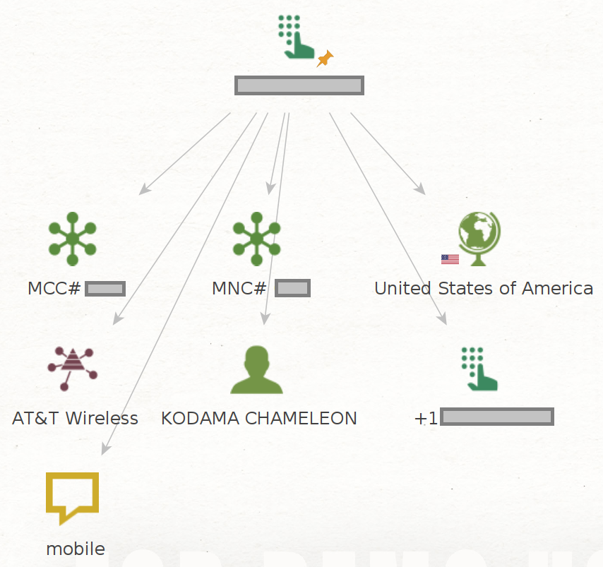

# Twilio-Maltego
### Utilize Twilio API for Maltego Transforms


[](https://www.python.org/)

Version: 1.0.0-beta

## 💎 About

Convert data from [Twilio's API](https://www.twilio.com/docs/lookup/v2-api) to Maltego entities (key required). At this time, Twilio's basic phone number validation is free. The others cost per lookup, so maybe don't get too carried away💸.

Please use this tool ethically by respecting people's privacy and only collecting intelligence where explicit permission has been granted or otherwise legally qualified to do so. We are not responsible for any illegal use.

## 🛠️ Setup

### Requirements
- Maltego 4.3.0
- [Python 3.11.2](./requirements.txt)

### Restricted Access Folder

Not all of Twilio's API endpoints are publically available. If you are one of the lucky ones, move the .py files in the restricted_access folder to the transforms directory before running setup.py.
   
### Installation
```
   git clone https://github.com/kodamaChameleon/twilio-maltego.git
   cd twilio-maltego
   python3 setup.py
```
Enter your Accound_SID and Auth_Token when prompted. Import Twilio-Maltego.mtz into Maltego to begin running locally.

## 🧙 Features



| Name               | Description                                                       | Options       |
|--------------------|-------------------------------------------------------------------|---------------|
| checkAll           | Returns details from Twilio API lookup for all services available | 💰            |
| checkCallForwarding| Returns details from Twilio API lookup for call forwarding        | 💰            |
| toCaller           | Returns details from Twilio API lookup for caller                 | 💰            |
| toCarrier          | Returns details from Twilio API lookup for carrier                | 💰            |
| validateNumber     | Validate phone number with Twilio API                             |               |
| checkActivity      | Get date of last SIM swap                                         | 💰🚫         |
| simSwapCheck       | Get date of last SIM swap                                         | 💰🚫         |

💰 cost/lookup  
🚫 not publically available
   
## 📜 License


[Creative Commons Attribution-ShareAlike 4.0 International License](https://creativecommons.org/licenses/by-sa/4.0/)  
Copyright (C) 2023 KodamaChameleon
